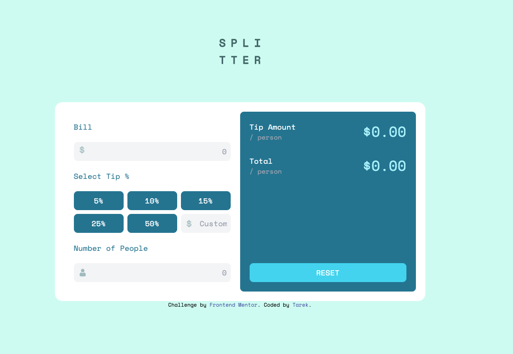
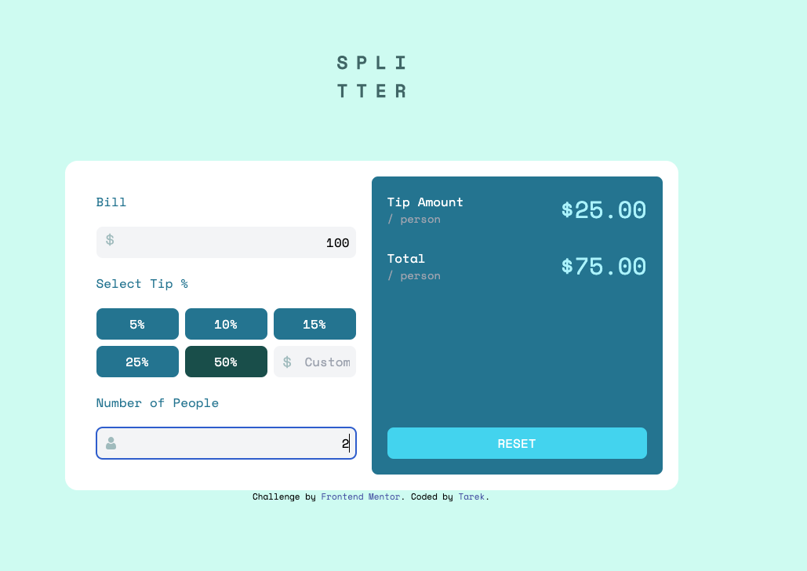
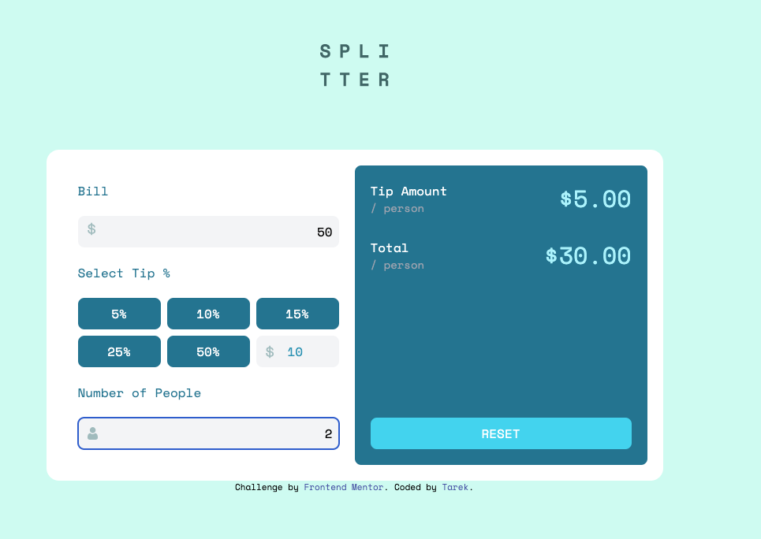
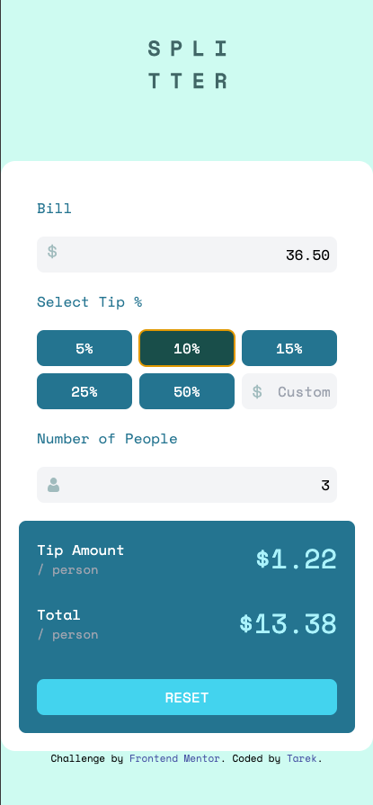

# Frontend Mentor - Tip calculator app

 

# Challenges I encountered

- Working with the JavaScript DOM events
- Working with the JavaScript DOM form events
- Working with the JavaScript DOM form validation

# Most Proud of

- Using the JavaScript DOM to create a calculator app
- Using the JavaScript DOM to create a form
- Using the JavaScript DOM to create a form validation

